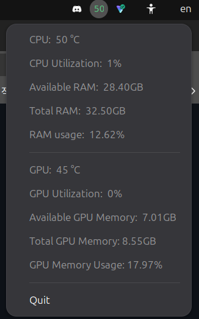

# CPU/GPU Tray Monitor

A lightweight system-resource monitor that lives in the GNOME top bar. The panel
icon shows your current **CPU temperature** as a color-coded number, and clicking
it opens a menu with the full breakdown: CPU and GPU temperature, utilization,
and RAM / VRAM usage. It refreshes on a configurable interval (2 seconds by
default).

Written in Rust with no GTK dependency — the tray is a pure
[StatusNotifierItem](https://www.freedesktop.org/wiki/Specifications/StatusNotifierItem/),
CPU/RAM come from `sysinfo`, GPU metrics come from a small per-vendor layer
(NVIDIA via NVML, AMD via sysfs, Intel best-effort), and the icon text is drawn
directly to a bitmap with `ab_glyph`.

## Screenshot


## Features

- Color-coded CPU temperature in the panel: green when cool, amber when warm
  (>= 65 C), red when hot (>= 80 C).
- Click-to-open menu showing:
  - CPU temperature and utilization
  - Available RAM, total RAM, and RAM usage %
  - GPU temperature and utilization
  - Available VRAM, total VRAM, and VRAM usage %
- **Multi-vendor GPU support**, auto-detected at startup:
  - **NVIDIA** — full temp / utilization / VRAM via NVML
  - **AMD** — full temp / utilization / VRAM via sysfs (no extra tooling)
  - **Intel** — temperature only where exposed (see Limitations)
- **Configurable** via a TOML file — refresh interval and icon/font sizing.
- Degrades gracefully: a missing GPU, missing config file, or unreadable sensor
  falls back to sensible defaults rather than crashing.

## Requirements

- **Linux with a StatusNotifierItem host.** On GNOME that means the
  *AppIndicator and KStatusNotifierItem Support* extension must be installed and
  enabled — without it the tray has nowhere to appear and the app exits on
  startup with an error.
- **A GPU for the GPU metrics** (CPU, RAM, and the panel icon work regardless):
  - NVIDIA: NVML is loaded at runtime from the driver you already have
    (`libnvidia-ml`); no extra package needed.
  - AMD: read straight from the kernel's `amdgpu` sysfs interface; nothing to
    install.
  - Intel: temperature only, and only on GPUs that expose it (discrete Arc);
    integrated GPUs usually don't. See Limitations.
- **Rust toolchain** (stable) to build — install via [rustup](https://rustup.rs).
- **A font file** at `assets/DejaVuSans.ttf`, embedded into the binary at compile
  time. On Ubuntu, copy the system copy into place (see Building).

## Building

Then build a release binary:

```sh
cargo build --release
```

The optimized executable is written to `target/release/resource-monitor`

## Running

Launch it directly:

```sh
cargo run --release
# or run the built binary:
./target/release/resource-monitor
```

The icon appears in the top bar. Click it for the full menu; **Quit** stops the
app (or press `Ctrl+C` in the terminal). Because it polls forever, it won't exit
on its own — that's expected.

### Start automatically on login

Create `~/.config/autostart/resource-monitor.desktop`:

```ini
[Desktop Entry]
Type=Application
Name=CPU/GPU Tray Monitor
Exec=/home/YOURUSER/.local/bin/resource-monitor
X-GNOME-Autostart-enabled=true
```

Copy the binary to `~/.local/bin/` first, and use the full absolute path in
`Exec=` (autostart doesn't reliably use your shell `PATH`).

## Configuration

Settings live in a TOML file at:

```
~/.config/resource-monitor/config.toml
```

The file is **optional** — if it's missing, or a field is
omitted, or it fails to parse, the app falls back to the built-in defaults, so it
never blocks startup. A parse error prints a warning and continues with defaults.

Available keys (shown with their defaults):

```toml
interval_secs = 2     # how often to refresh, in seconds
icon_width    = 32    # tray icon width in pixels
icon_height   = 32    # tray icon height in pixels
font_px       = 32.0  # temperature text size in pixels
```

A copy of this lives in `config.example.toml` in the repo — copy it to the path
above and edit to taste.

A few things remain hardcoded in the source (change them there if needed):

- **Temperature color thresholds** — `temp_color()` in `src/tray.rs`.
- **CPU temperature sensor selection** — see How it works.

## How it works

- `config.rs` defines the `Config` struct (with `serde` defaults) and loads it
  once via a `OnceLock`, so every module can read the same settings through
  `config()` without passing an object around. Reads `~/.config/resource-monitor/config.toml`,
  falling back to defaults on any problem.
- `metrics.rs` holds the long-lived handles (`sysinfo::System`,
  `sysinfo::Components`, and a `Gpu`) and exposes `read()` returning a `Readings`
  snapshot. CPU temperature is matched robustly: it looks for a component label
  containing `"Package id"` (Intel) or `"Tctl"` (AMD), and if neither is present
  or returns a value, falls back to the hottest `Core*` reading.
- `gpu.rs` abstracts the GPU behind a `Gpu` enum (`Nvidia` / `Amd` / `Intel` /
  `None`), chosen once at startup: it tries NVML first, then scans
  `/sys/class/drm/card*` by PCI vendor id. Each backend returns the same
  `GpuReadings` (temp, utilization, memory used/total). The NVIDIA `Device` is
  fetched fresh each read because it borrows from the `Nvml` and can't be stored
  alongside it.
- `render.rs` draws the temperature string into an ARGB32 bitmap sized from the
  config. The buffer is built as straight RGBA, then each pixel is rotated one
  byte (`[R,G,B,A]` -> `[A,R,G,B]`) because ksni expects ARGB32 in network byte
  order.
- `tray.rs` implements `ksni::Tray`: `icon_pixmap()` renders the current CPU
  temp, and `menu()` builds the full read-out.
- `main.rs` spawns the tray, then loops: sleep for the configured interval, read
  fresh metrics, and `handle.update(...)`, which makes ksni re-read both the icon
  and the menu.

## Known limitations

- **GPU coverage varies by vendor.** NVIDIA and AMD report full temp /
  utilization / VRAM. Intel reports temperature only where the hardware exposes
  it (discrete Arc); integrated Intel GPUs generally share the CPU package and
  expose no separate temperature, and Intel utilization/VRAM aren't read at all —
  those require the i915/xe performance counters (PMU), which need elevated
  privileges and are out of scope here.
- **The panel icon shows a single number.** GNOME renders tray icons as a square
  via `St.Icon`, so a wider multi-value readout isn't possible through this path;
  the CPU temp is the headline and everything else lives in the menu.
- **No hover tooltips.** The GNOME AppIndicator extension doesn't implement
  StatusNotifierItem tooltips, which is why all detail is in the click menu.
- **Memory is reported in decimal GB** (/ 1,000,000,000), so values are slightly
  higher than the GiB figures shown by tools like `free -h`.

## Project structure

```
src/
├── main.rs      # entry point: load config, spawn tray, poll loop
├── config.rs    # TOML config (serde) loaded once via OnceLock
├── metrics.rs   # data collection (CPU/RAM via sysinfo, GPU via gpu.rs)
├── gpu.rs       # vendor detection + per-vendor GPU backends
├── render.rs    # draws the temperature text into the tray icon
└── tray.rs      # ksni Tray impl: icon + menu
assets/
└── DejaVuSans.ttf     # embedded font (add manually)
config.example.toml
Cargo.toml
```

## License

MIT License
